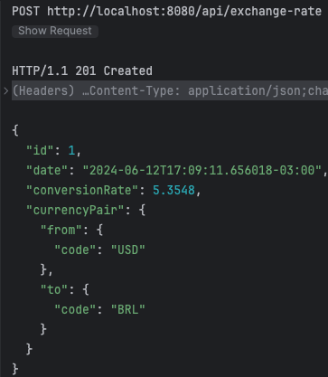

# Currency Exchange Rate - Service

## Requirements

- Java 21

## Tech stack

- Java 21
- Quarkus 3.11
- Hibernate
- H2

## Integration

- https://www.exchangerate-api.com/

## Running

You can run your application in dev mode that enables live coding using:

```shell script
./gradlew quarkusDev
```

## Packaging

The application can be packaged using:

```shell script
./gradlew build
```

## Tests


Use `requests.http` to test after startup the app


```
###
GET http://localhost:8080/api/exchange-rate

###
POST http://localhost:8080/api/exchange-rate
Content-Type: application/json

{
"from": "USD",
"to": "BRL"
}
```